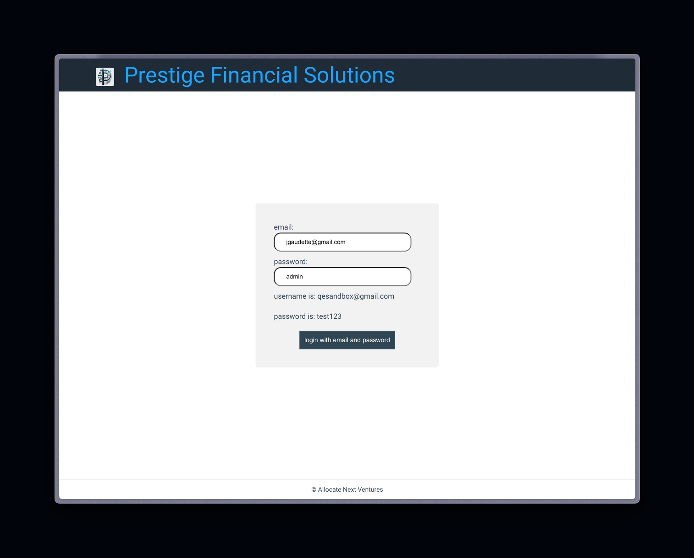
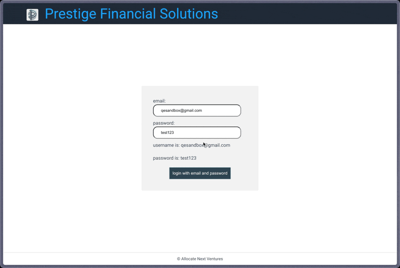
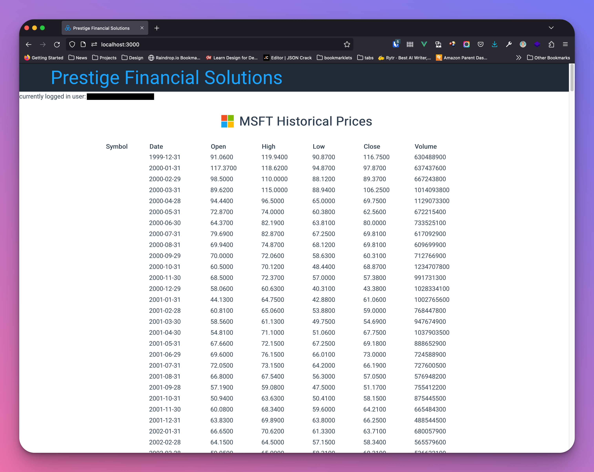

# Interview Tasks

These are the same tasks tracked on the Portable Kanban board (`tasks.kanban`).
They are mirrored here because the Portable Kanban webview cannot render images —
the mockups below only display in a normal Markdown view (VS Code's built-in
preview, or GitHub).

---

## Style the login page

Our login page is not styled well, and we wish to make a better first impression
with our clients.

Our designer has come up with some guidance and a mockup for how the login page
should look:

- centered on page
- 400px wide
- background color of `#f2f2f2`
- add 40px of padding
- curve the box edges by 6px



---

## Add a logout button

There is currently no way for a user to logout of the site.

- The button should be positioned in the header
- It should be right aligned
- Ensure it only shows up when the user is logged in



---

## Create a stock table for MSFT

Our customers are very interested in the historical monthly stock price of
Microsoft ($MSFT). They would like to see, front and center, a table showing the
following fields:

- date
- open
- high
- low
- close
- total volume

We have contracted with a service provider, Alpha Vantage, to provide this data
for us. Due to rate limiting of the production endpoint, they have also provided
a dev endpoint for us to hit during development. Their API is as follows:

- **Dev:** `http://jon.allocate.build/msft.json`

Our designer has come up with the following mockup for the table. The guidance
from design is to have the table be 75% the width of the screen, and that each
row should have 2px of top and bottom padding.

The designers would also like the company symbol to appear in the heading. Our
SA found a great service that allows hotlinking, and can be accessed via:
`https://financialmodelingprep.com/image-stock/{SYMBOL}.png`

A junior engineer has started a table component that can be used: `TimeSeriesTable`
(`src/components/TimeSeriesTable.vue`).


---

## Fix the top stocks page

The top stocks page (`/top-stocks`) has been reported as no longer working. This
is what the page should look like:



---

## Support different stocks via the URL path

Currently, our application displays stock information only for Microsoft ($MSFT).
We want to extend this functionality to support displaying information for
different stocks based on the URL path parameter.

### Expected behavior

- When a user visits the stock information page with a specific stock symbol in
  the URL path, e.g. `/AAPL`, the application should display stock information for
  Apple Inc. ($AAPL) instead of Microsoft ($MSFT).
- The application should handle the case where a user inputs an invalid stock
  symbol or a stock symbol that doesn't exist in our data source. In such cases,
  display an appropriate error message.
- Update the UI to allow users to easily navigate to different stock information
  pages.

---

## Add a property to the global Window object

`src/App.vue` assigns a custom property to `window` for debugging:

```ts
window.__PRESTIGE__ = { firebase: firebaseApp }
```

This raises a TypeScript error (*Property '__PRESTIGE__' does not exist on type
'Window & typeof globalThis'*). Run `npm run typecheck` (or check your editor) to
see it.

- Make `npm run typecheck` pass **without** disabling or escaping the type
  checker (no `// @ts-ignore`, no `as any`).
- The property should be properly typed wherever it is accessed.
